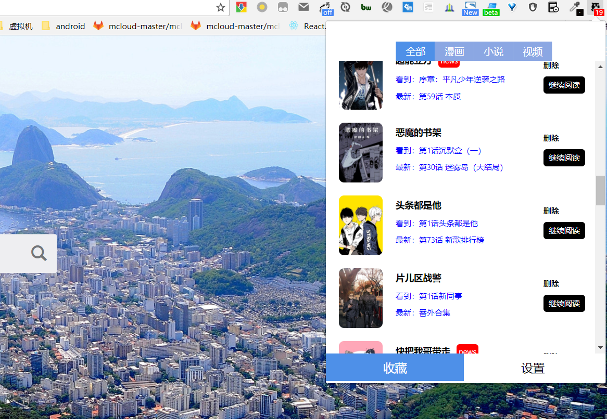
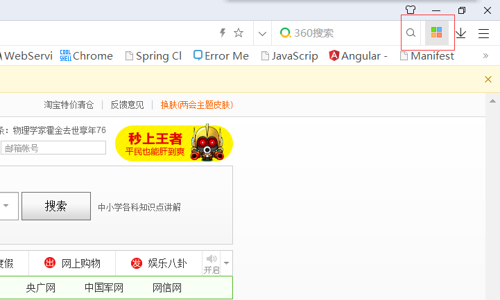

# 追综饭
追综饭是一款浏览器扩展，使用该插件能够添加漫画、小说、视频到插件中收藏，能够导出网站中收藏的小说、漫画、视频到插件中，收藏有更新时能够提醒用户。还能够导出收藏到其他电脑浏览器上恢复数据。

支持的网站
漫画：快看、腾讯动漫、漫画之家、古风漫画
小说：起点
视频:bilibili

下一步将会考虑支持更多的网站，也会考虑加入新的功能。感谢大家的使用，欢迎大家与我讨论交流。

## 截图

- 截图一

- 截图二

## 安装
非Safari、Opera、Firefox、IE可以使用以下方案安装。
下载追综饭.crx文件，打开浏览器的扩展页拖入其中即可安装完成。

如：360极速浏览器
启动浏览器，找到扩展中心点开

拖动插件文件crx到浏览器中并选择添加即可完成安装

## 使用
到支持的站点的漫画目录页或漫画内容页，即可看到对应的图标，鼠标移动到图标上会有对应的功能说明。点击图标即可启动功能。

- github地址:[https://github.com/YeomanYe/comic-assistant](https://github.com/YeomanYe/comic-assistant)
- 作者邮箱:ming1549957235@foxmail.com

交流Q群:729873411

## 下一步

* [ ] 搜索本地收藏
* [ ] 设为已读
* [ ] 更好的通知
* [ ] 批量操作